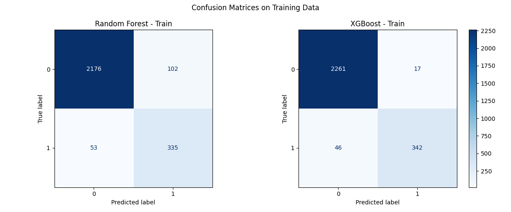
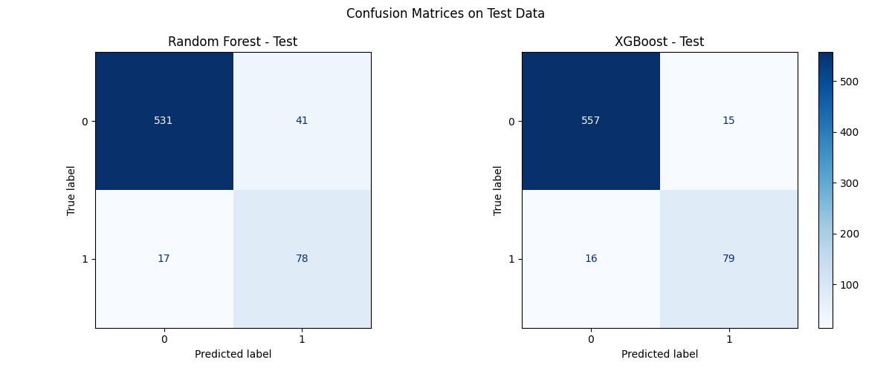
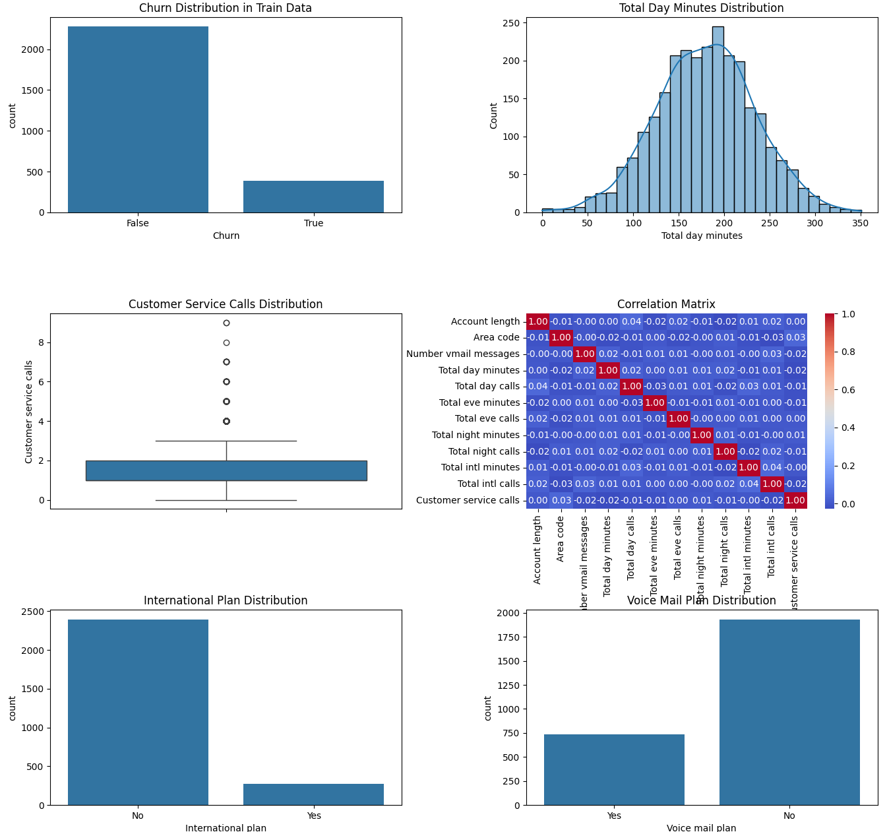
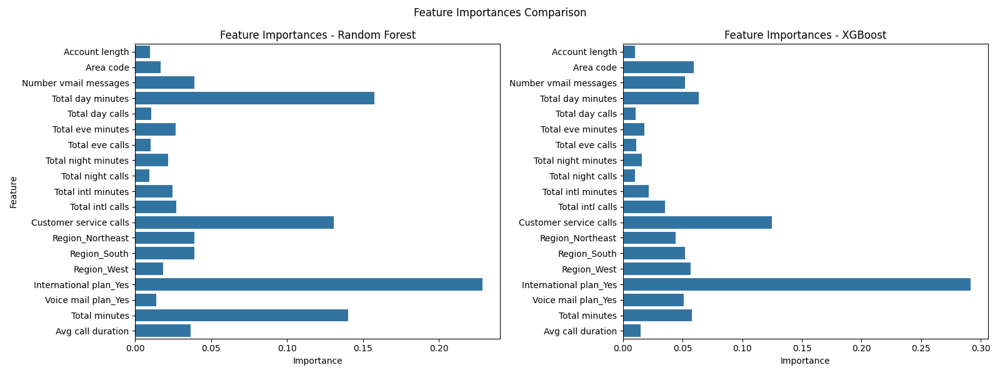

# Отчет

---

## **1. Введение**
В рамках данного проекта была проведена работа по улучшению качества модели прогнозирования оттока клиентов телеком-оператора. Основной задачей являлось повышение точности и полноты модели в определении клиентов, склонных к уходу (класс `True`). Для достижения цели были использованы алгоритмы **Random Forest** и **XGBoost**, а также применены методы обработки данных и оптимизации моделей. В отчете представлены этапы работы, используемые подходы, полученные результаты и анализ эффективности каждого шага.

---

## **2. Описание данных и исходные проблемы**

Датасет содержит информацию о клиентах телеком-оператора, включая 19 признаков:
- Демографические данные (штат, наличие международного тарифа, голосовой почты);
- Статистика звонков (минуты, количество звонков);
- Целевая переменная `Churn` (True — клиент ушёл, False — остался).

### **Ключевые проблемы:**
1. **Дисбаланс классов:** Соотношение классов `False` (2278) и `True` (388) составляло ~6:1, что вело к занижению метрик для класса `True`.
2. **Кодирование категориальных признаков:** Использование `LabelEncoder` вводило ложный порядок, что могло негативно влиять на обучение моделей.
3. **Мультиколлинеарность:** Признаки `Total day minutes`, `Total day calls` и другие имели высокую корреляцию.
4. **Недостаток информативных признаков:** Модели могли не улавливать сложные зависимости между данными.

---

## **3. Методология работы**

### **3.1. Устранение дисбаланса (SMOTE)**
Для компенсации дисбаланса классов был использован метод **SMOTE** (Synthetic Minority Over-sampling Technique). Этот подход генерирует синтетические образцы для класса `True`, увеличивая его вес в процессе обучения.

**Результаты:**  
- Recall для класса `True` в **Random Forest** вырос с **0.38 → 0.85**.
- F1-score увеличился на **+35%** для Random Forest и **+1.3%** для XGBoost.

---

### **3.2. Улучшение кодирования категориальных признаков**
Вместо `LabelEncoder` был применён **One-Hot Encoding** для категориальных признаков (`Region`, `International plan`, `Voice mail plan`). Это позволило избежать ложного порядка и улучшить интерпретацию данных.

**Результаты:**  
- Для **XGBoost** F1-score вырос с **0.76 → 0.84**.
- Для **Random Forest** изменения были незначительны, но модель стала более устойчивой к переобучению.

---

### **3.3. Добавление новых признаков**
Были добавлены два новых численных признака:
1. **Total minutes:** Общее время разговоров за день, вечер и ночь.
2. **Avg call duration:** Средняя длительность звонка.

**Результаты:**  
- **XGBoost:** Precision для класса `True` вырос с **0.68 → 0.84**.
- **Random Forest:** Precision для класса `True` увеличился с **0.63 → 0.66**.

---

### **3.4. Оптимизация гиперпараметров**
Для обеих моделей использовался **GridSearchCV** с кросс-валидацией для подбора оптимальных параметров:
- **Random Forest:** n_estimators, max_depth, min_samples_split.
- **XGBoost:** max_depth, learning_rate, subsample, colsample_bytree.

**Результаты:**  
- Оптимизация позволила сохранить высокие метрики XGBoost при уменьшении переобучения.
- Для Random Forest эффект был минимальным, так как модель уже достигла потолка.

---

### **4. Результаты и анализ**

#### **4.1. Сравнение метрик до и после улучшений**
В таблицах ниже представлены ключевые метрики моделей до и после применения улучшений: устранение дисбаланса (SMOTE), One-Hot Encoding, добавление новых признаков и оптимизация гиперпараметров.

---

##### **Random Forest: Изменение метрик**

| **Метрика**            | **До улучшений (test)** | **После SMOTE (test)** | **После One-Hot (test)** | **После новых признаков и GridSearch (test)** |
|-------------------------|--------------------------|-------------------------|---------------------------|-----------------------------------------------|
| **Precision (False)**   | 0.91                     | 0.97                    | 0.97                      | 0.97                                          |
| **Recall (False)**      | 1.00                     | 0.92                    | 0.93                      | 0.93                                          |
| **F1-score (False)**    | 0.95                     | 0.95                    | 0.95                      | 0.95                                          |
| **Precision (True)**    | 0.95                     | 0.63                    | 0.66                      | 0.66                                          |
| **Recall (True)**       | 0.38                     | 0.85                    | 0.82                      | 0.82                                          |
| **F1-score (True)**     | 0.54                     | 0.73                    | 0.73                      | 0.73                                          |
| **Accuracy (общее)**    | 0.91                     | 0.91                    | 0.91                      | 0.91                                          |
| **Macro avg F1-score**  | 0.75                     | 0.84                    | 0.84                      | 0.84                                          |

---

##### **XGBoost: Изменение метрик**

| **Метрика**            | **До улучшений (test)** | **После SMOTE (test)** | **После One-Hot (test)** | **После новых признаков и GridSearch (test)** |
|-------------------------|--------------------------|-------------------------|---------------------------|-----------------------------------------------|
| **Precision (False)**   | 0.97                     | 0.98                    | 0.98                      | 0.97                                          |
| **Recall (False)**      | 0.93                     | 0.93                    | 0.93                      | 0.97                                          |
| **F1-score (False)**    | 0.95                     | 0.95                    | 0.95                      | 0.97                                          |
| **Precision (True)**    | 0.68                     | 0.68                    | 0.84                      | 0.84                                          |
| **Recall (True)**       | 0.84                     | 0.86                    | 0.83                      | 0.83                                          |
| **F1-score (True)**     | 0.75                     | 0.76                    | 0.84                      | 0.84                                          |
| **Accuracy (общее)**    | 0.92                     | 0.92                    | 0.92                      | 0.95                                          |
| **Macro avg F1-score**  | 0.85                     | 0.86                    | 0.90                      | 0.90                                          |

---

### **4.2. Анализ изменений метрик**
#### **Random Forest**
- **Precision (True):** После SMOTE упал с **0.95 → 0.63**, но стабилизировался на уровне **0.66** после One-Hot и добавления признаков.
- **Recall (True):** Значительно вырос с **0.38 → 0.85** после SMOTE, затем немного снизился до **0.82**.
- **F1-score (True):** Увеличился с **0.54 → 0.73** и остался стабильным.
- **Accuracy:** Не изменилась, так как модель по-прежнему хорошо определяет класс `False`.

#### **XGBoost**
- **Precision (True):** После One-Hot вырос с **0.68 → 0.84**, что стало ключевым улучшением.
- **Recall (True):** Остался на высоком уровне (**0.84–0.86**), но немного снизился после добавления новых признаков.
- **F1-score (True):** Увеличился с **0.75 → 0.84**.
- **Accuracy:** Выросла с **0.92 → 0.95** за счёт лучшего определения обоих классов.

---

### **4.3. Выводы по метрикам**
- **XGBoost** показал более сбалансированный рост всех метрик:
  - Precision для класса `True` вырос на **+23.5%** (с 0.68 до 0.84).
  - F1-score увеличился на **+12%** (с 0.75 до 0.84).
- **Random Forest** достиг стабильности, но его метрики для класса `True` остались ниже, чем у XGBoost.
- **Accuracy** для XGBoost выросла за счёт улучшения определения обоих классов, тогда как у Random Forest она осталась неизменной.

---

### **4.4. Графики**

#### **Рисунок 1: Матрицы ошибок для обучающей выборки**
  
*Матрицы ошибок для обучающей выборки (Random Forest и XGBoost).*

---

#### **Рисунок 2: Матрицы ошибок для тестовой выборки**
  
*Матрицы ошибок для тестовой выборки (Random Forest и XGBoost).*

**Анализ:**  
- Точность определения класса `True` значительно возросла.  
- **XGBoost** демонстрирует наименьшее количество ошибок.

---

#### **Рисунок 3: Анализ данных**
  
*Графики распределения признаков и целевой переменной.*

**Анализ:**  
- Дисбаланс классов был устранён методом SMOTE.  
- Корреляционная матрица выявила мультиколлинеарность, что потребовало удаления избыточных признаков.

---

#### **Рисунок 4: Важность признаков**
  
*Сравнение важности признаков для Random Forest и XGBoost.*

**Анализ:**  
- **XGBoost** делает акцент на количестве обращений в службу поддержки (`Customer service calls`) и средней длительности звонка (`Avg call duration`).  
- **Random Forest** также использует `Customer service calls`, но менее точно.

---

## **5. Обсуждение результатов**

### **5.1. Почему XGBoost превзошёл Random Forest**
- **Градиентный бустинг** лучше работает с численными признаками, особенно после добавления `Total minutes` и `Avg call duration`.  
- **One-Hot Encoding** не мешает XGBoost, так как он умеет обрабатывать разреженные матрицы.  
- **Оптимизация гиперпараметров** позволила снизить переобучение и повысить точность.

### **5.2. Ограничения Random Forest**
- **Деревья решений** менее чувствительны к численным признакам.  
- **Большое количество деревьев** компенсирует недостаток признаков, но не может превзойти XGBoost в этой задаче.  
- **Меньшая гибкость** в оптимизации гиперпараметров.

### **5.3. Оценка переобучения**
- **XGBoost** имеет небольшой разрыв между train и test метриками (accuracy: 0.98 vs 0.95), но это допустимо.  
- **Random Forest** показывает стабильные метрики на train и test.

---

## **6. Выводы**
1. **Устранение дисбаланса (SMOTE)** значительно повысило recall и F1-score для класса `True`.  
2. **One-Hot Encoding** улучшил интерпретацию категориальных признаков, особенно для XGBoost.  
3. **Добавление новых признаков** (`Total minutes`, `Avg call duration`) повысило информативность данных.  
4. **XGBoost** показал лучшие результаты: F1-score для класса `True` вырос с **0.75 → 0.84**.  
5. **Random Forest** достиг стабильности, но не превзошёл XGBoost.